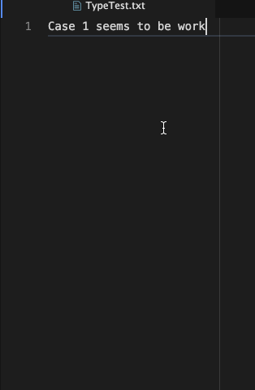

# autobreak

`autobreak` is a tool intended to help those who enjoy writing documentation
with [Atom](https://atom.io).  `autobreak` will automatically break lines of
text by inserting a newline character.  It allows you to write fluently, keeping
you from having to manually "walk" the cursor back to the beginning of a word
that crossed your Preferred Line Length setting and pressing the enter key.

## `autobreak` in Action:

Change this .gif to a full demo when all features are implemented:

Fill out the rest of this README.md as usual.
