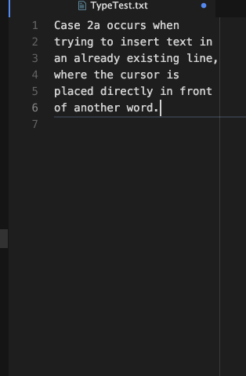
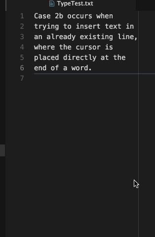
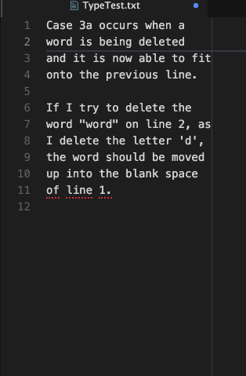
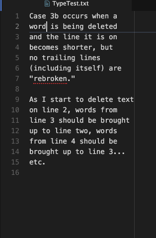

# TODO

- Only activate on plaintext formats (.txt, .md, etc.).  Give user a setting to
  add their own file formats that `autobreak` should work on.
- Enabling and Disabling don't seem to work.
- Can we make this more efficient by moving some of the variables within the
  `checkIfShouldBreakLines()` function to global scope so that they are not
  recalculated each keystroke?
- Add checkpoints before and after so that command undo can fix whatever is
  changed via this package (can't seem to get this to work properly).
- Is there a way to get the type of newline being used from the
  `line-ending-selector` package?  This is what should be inserted by default
  when autobreaking a line.
    - NOTE: Inserting the text into the buffer will automatically normalize
      line endings, so I probably don't have to worry about this too much.
- Mention in README.md, this does not support multiple cursors!
- Address all cases listed below and check for others.

## Cases to Address

- [X] Case 1:

- [ ] Case 2a:

- [ ] Case 2b:

- [ ] Case 3a:

- [ ] Case 3b:

